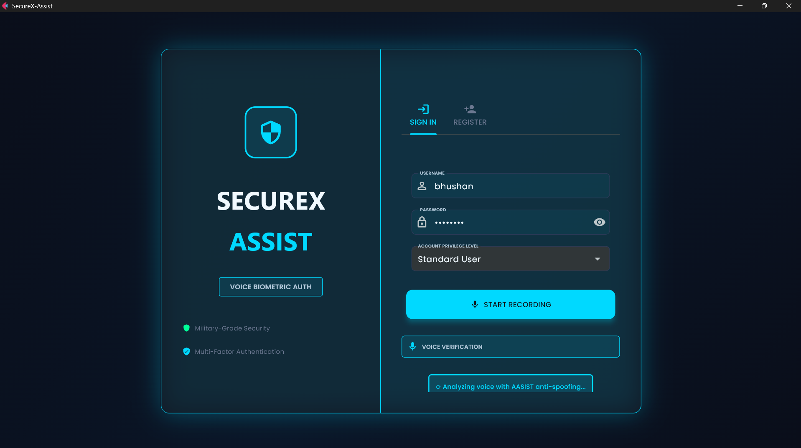
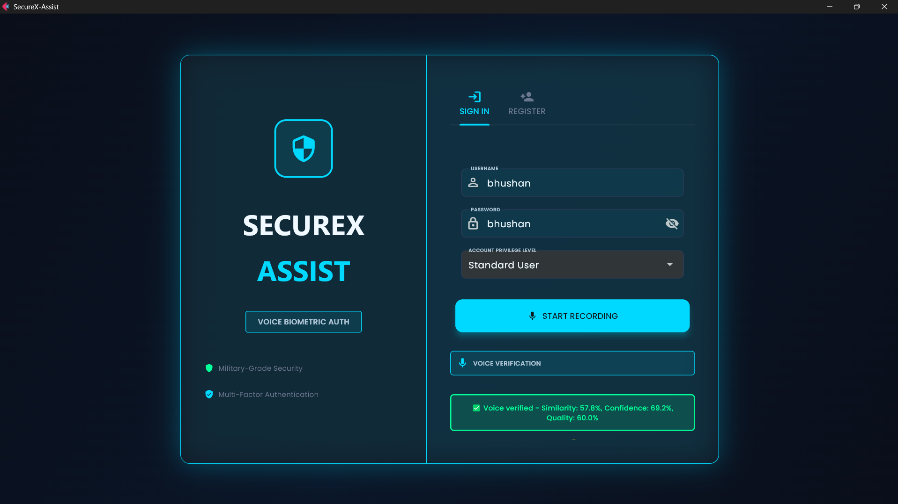
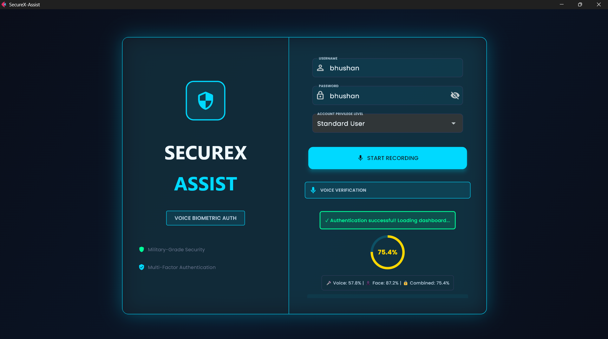
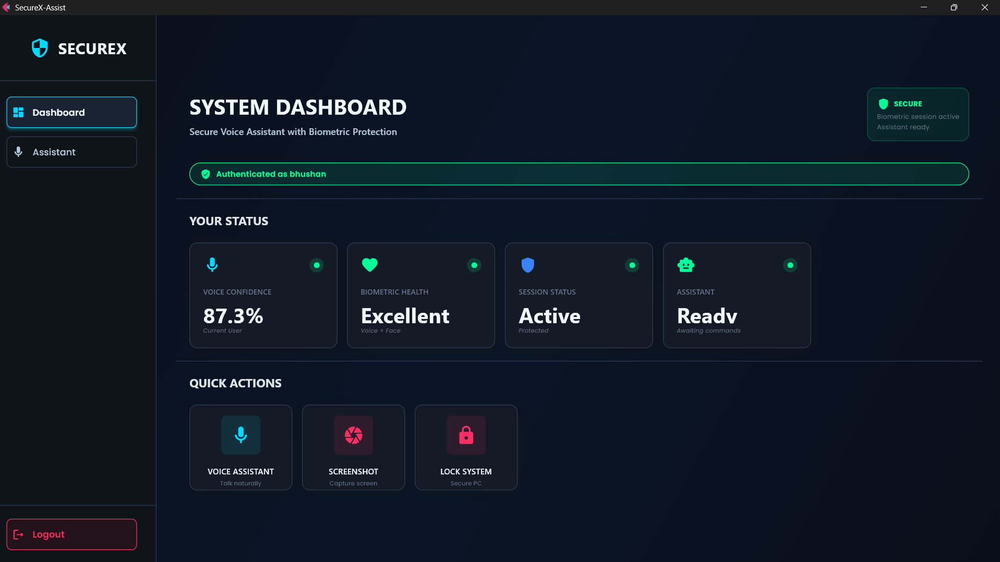
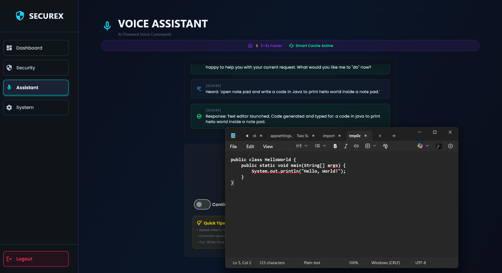

# SecureX-Assist 🔐

> **Multi-Modal Biometric Authentication & AI Voice Assistant for Secure Desktop Operations**  
> Accepted for publication at ICASET 2026 | Pillai HOC College of Engineering & Technology, Mumbai University

---

[]()
[]()
[]()
[]()
[]()
[]()

---

## 📌 What is SecureX-Assist??

**SecureX-Assist** is a research-oriented multi-modal authentication framework that combines biometric verification, liveness detection, and an AI voice assistant for secure desktop operations.

It unifies three security layers into one real-time pipeline:

| Layer | Technology | Purpose |
|---|---|---|
| Voice Biometrics | ECAPA-TDNN (192-dim) + AASIST | Speaker verification + anti-spoofing |
| Facial Recognition | ArcFace (512-dim) + RetinaFace | Identity confirmation |
| Liveness Detection | 468-point facial mesh, EAR analysis | Prevents photo/video replay attacks |
| Fusion Engine | Adaptive score-level fusion | Final auth decision: 98.75% accuracy |
| Voice Assistant | Whisper STT + TF-IDF intent classifier | Hands-free secure desktop commands |

Unlike traditional systems that primarily authenticate at login, **SecureX-Assist combines continuous biometric monitoring with AI-driven voice control** for secure desktop operations.

---

## 🏆 Key Results

| Metric | Voice Only | Face Only | **SecureX (Multi-Modal)** |
|---|---|---|---|
| Accuracy | 96.80% | 97.20% | **98.75%** |
| AUC-ROC | 0.873 | 0.893 | **0.994** |
| EER | 3.01% | — | **1.25%** |
| Intent Classification | — | — | **93.1% (24 categories)** |
| Cache Speedup | — | — | **51.9% latency reduction** |

> Multi-modal fusion reduces Equal Error Rate by **58%** compared to voice-only authentication.

---

## 🎬 Project Demonstration

<!-- Add GIF/screenshot of your live dashboard here -->
> Dashboard screenshots below — sci-fi themed real-time UI built with Flet/Flutter

| Login Interface | Voice Verification | Multi-Modal Fusion Result |
|---|---|---|
|  |  |  |

| **System Dashboard** | **Voice Command Execution** |
| -------------------- | --------------------------- |
|  |  |

---

## 🏗️ System Architecture

```
┌─────────────────────────────────────────────────────────────┐
│                    USER ENROLLMENT                          │
│  Register credentials → Voice enrollment (SpeechBrain)     │
│  → Face enrollment (InsightFace + ArcFace + MediaPipe)     │
└──────────────────────┬──────────────────────────────────────┘
                       │
┌──────────────────────▼──────────────────────────────────────┐
│                 USER AUTHENTICATION                         │
│                                                             │
│  Sign In → Password Verification (Security Manager)        │
│       │                                                     │
│       ▼                                                     │
│  ┌─────────────────────────────────────────┐               │
│  │     Voice Verification                  │               │
│  │  SpeechBrain ECAPA-TDNN (192-dim)       │               │
│  │  AASIST Anti-Spoofing Model             │               │
│  └──────────────────┬──────────────────────┘               │
│                     │                                       │
│  ┌──────────────────▼──────────────────────┐               │
│  │     Face Verification                   │               │
│  │  RetinaFace Detection                   │               │
│  │  ArcFace (512-dim) + MediaPipe Liveness │               │
│  └──────────────────┬──────────────────────┘               │
│                     │                                       │
│  ┌──────────────────▼──────────────────────┐               │
│  │     Weighted Score Fusion Engine        │               │
│  │  S_final = w1·S_voice + w2·S_face       │               │
│  │  Smart LRU Cache + Model Warm-up        │               │
│  └──────────────────┬──────────────────────┘               │
│                     │ Authenticated ✓                       │
└─────────────────────┼───────────────────────────────────────┘
                      │
┌─────────────────────▼───────────────────────────────────────┐
│              SECUREX-ASSIST DASHBOARD                       │
│                                                             │
│  Voice Commands → Whisper STT → TF-IDF Intent Classifier   │
│  → 24 Intent Categories → Secure Desktop Operations        │
│  (Open apps, lock, minimize, browse, generate code...)     │
│                                                             │
│  Continuous Session Monitoring + Audit Logging             │
└─────────────────────────────────────────────────────────────┘
```

---

## 🔬 Technical Deep Dive

### A. Voice Biometric Module
- **Model:** ECAPA-TDNN (Emphasized Channel Attention, Propagation and Aggregation)
- **Embedding:** 192-dimensional, L2-normalized speaker embeddings via SpeechBrain
- **Anti-Spoofing:** AASIST (Audio Anti-Spoofing using Integrated Spectro-Temporal Graph Attention Networks) — detects replayed and synthetically generated voices
- **Preprocessing:** VAD (Silero), noise reduction, sampling standardization

### B. Facial Recognition & Liveness Module
- **Detection:** RetinaFace for robust multi-scale face detection
- **Embedding:** ArcFace — 512-dimensional angular margin embeddings (InsightFace)
- **Liveness:** 468-point MediaPipe facial mesh analyzing:
  - Eye Aspect Ratio (EAR) for blink detection
  - Head movement patterns to prevent photo/video spoofing

### C. Multi-Modal Fusion Engine
```
S_final = α · S_voice + β · S_face + γ · S_liveness
```
where α, β, γ are adaptive weights tuned on validation data. The weighted combination achieves **AUC = 0.994** vs 0.873 (voice-only) and 0.893 (face-only).

### D. AI Voice Assistant
- **STT:** OpenAI Whisper — streaming audio transcription
- **Intent Classification:** TF-IDF vectorizer + multi-class classifier
- **Categories:** 24 predefined intents (open app, lock, minimize, browse, code generation, etc.)
- **Intent Accuracy:** 93.1%
- **TTS Response:** Piper TTS for low-latency voice feedback

### E. Performance Optimization
- **Model Warm-up:** Pre-loads models into memory at startup — 3–4× response improvement
- **Smart LRU Cache:** Caches recent verification results — **51.9% speedup** on repeated ops
- **Streaming Verification:** Processes audio in chunks — enables real-time desktop use

### F. Security Architecture
- **Encryption:** AES-128 Fernet for all biometric template storage
- **Rate Limiting:** Max 10 auth requests/60 seconds
- **Lockout Policy:** 15-minute account lockout after 5 consecutive failures
- **Audit Logging:** All system actions and authentication events logged to SQLite

---

## 📁 Repository Structure

```text
Intelligent-Voice-Authentication/
│
├── api/
├── config/
├── core/
├── models/
├── screenshots/
├── scripts/
├── ui/
├── utils/
│
├── main.py
├── requirements.txt
├── README.md
├── .gitignore
└── .env.example

```

## ⚙️ Installation & Setup

### Prerequisites

- Python 3.10+
- CUDA-compatible GPU (recommended) or CPU fallback
- Webcam + Microphone
- 8GB RAM minimum

### 1. Clone the repository

```bash
git clone https://github.com/jagtapbhushan254-alt/Intelligent-Voice-Authentication.git
cd Intelligent-Voice-Authentication
```

### 2. Create virtual environment
```bash
python -m venv venv

# Linux/macOS
source venv/bin/activate

# Windows
venv\Scripts\activate
```

### 3. Install dependencies
```bash
pip install -r requirements.txt
```

### 4. Download pretrained model weights
```bash
python scripts/download_models.py
# Downloads: ECAPA-TDNN (SpeechBrain), ArcFace (InsightFace), AASIST, Whisper
```

### 5. Configure environment
```bash
cp .env.example .env
# Edit .env with your settings (DB path, model paths, thresholds)
```

### 6. Launch SecureX-Assist
```bash
# Option A: Full dashboard
python main.py
```

---

## 🚀 Usage

### New User Registration
```bash
python scripts/enroll_user.py --username your_name
# Guides through: voice sample collection → face capture → profile creation
```

### Authentication Flow
1. Launch dashboard → Enter username/password
2. System captures 3–6 seconds of voice + live face simultaneously
3. AASIST screens for replay/synthetic voice attacks
4. MediaPipe liveness check confirms live presence
5. Score fusion computes S_final → Access granted/denied
6. On success: AI voice assistant activates for session

### Voice Commands (24 intents)
```
"Open YouTube"          → opens browser to youtube.com
"Lock the screen"       → triggers OS screen lock
"Minimize window"       → minimizes active window
"Open calculator"       → launches calculator
"Generate code for X"   → opens editor, generates code
... and 19 more
```

---

## 📊 Experimental Results

### Authentication Accuracy Comparison
```
Voice Only   : 96.80%  ████████████████████░░
Face Only    : 97.20%  █████████████████████░
Multi-Modal  : 98.75%  ███████████████████████  ← intelligent-voice-authentication
```

### Equal Error Rate (EER)
```
Voice Only       : 3.01%   (FAR = FRR crossover)
Multi-Modal Fusion: 1.25%  ← 58% reduction in error
```

### ROC-AUC Scores
| Method | AUC |
|---|---|
| Voice Only | 0.873 |
| Face Only | 0.893 |
| **Multi-Modal Fusion** | **0.994** |
| Random Classifier | 0.500 |

### Response Time Optimization
| Scenario | Without Cache | With Smart Cache |
|---|---|---|
| 1st verification | baseline | baseline |
| Repeated ops | baseline | **51.9% faster** |
| Cold start → warm | 3–4× slower | warm (pre-loaded) |

---

## 🔬 Research Context

This research was accepted for publication at **ICASET 2026**. The research builds on:

- **ECAPA-TDNN** (Desplanques et al., Interspeech 2020) — state-of-the-art speaker embeddings
- **AASIST** (Jung et al., ICASSP 2022) — spectro-temporal graph attention for anti-spoofing
- **ArcFace** (Deng et al.) — angular margin loss for robust face recognition
- **Spoof-aware embedding spaces** (Liu et al., IEEE TASLP 2024)
- **Continuous learning for deepfake detection** (Nguyen Le et al., 2024)

---

## 🔮 Future Work

- [ ] Mobile deployment (iOS/Android biometric bridge)
- [ ] Additional modalities: keystroke dynamics, gait recognition
- [ ] Federated learning for privacy-preserving model updates
- [ ] Hardware Security Module (HSM) integration for enterprise deployment
- [ ] Continuous learning pipeline for new spoofing attack types

---

## 👨‍💻 Author

**Bhushan Prabhakar Jagtap**  
B.E. Computer Engineering — Pillai HOC College of Engineering & Technology, Mumbai University  

[](www.linkedin.com/in/bhushan-jagtap999)
[](https://github.com/jagtapbhushan254-alt)
[](mailto:jagtapbhushan254@gmail.com)

**Co-author:** Aayush Gunjal  
**Faculty Guide:** Prof. Shrutika Khobragade

---

## 📄 Citation

If you use this work in your research, please cite:

```bibtex
@inproceedings{jagtap2026securex,
  title     = {Voice Based Biometric Authentication and AI Assistant for Secure Desktop Operations},
  author    = {Jagtap, Bhushan Prabhakar and Gunjal, Aayush Ajit and Khobragade, Shrutika},
  booktitle = {Proceedings of the International Conference on Advanced Science, Engineering and Technology (ICASET)},
  year      = {2026},
  institution = {Pillai HOC College of Engineering and Technology, Mumbai University}
}
 ```
<p align="center">
  <i>Built with ❤️ at Pillai HOC College of Engineering and Technology, Mumbai</i><br>
  <i>Accepted for publication at ICASET 2026</i>
</p>
